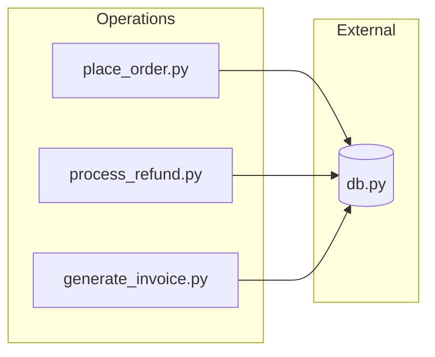

# Architecture

```mermaid
graph LR
    subgraph Operations
        PO[place_order.py]
        PR[process_refund.py]
        GI[generate_invoice.py]
    end

    subgraph External
        DB[(db.py)]
    end

    PO --> DB
    PR --> DB
    GI --> DB
```

Each operation is a self-contained file. Read it top to bottom to understand the full business logic.

```mermaid
graph TD
    subgraph "place_order.py"
        A1[Load customer and products] --> A2[Validate active customer and stock]
        A2 --> A3[Calculate subtotal, VAT, total]
        A3 --> A4[Save order and update stock]
    end

    subgraph "process_refund.py"
        B1[Load order] --> B2[Validate status and quantities]
        B2 --> B3[Calculate refund subtotal, VAT, total]
        B3 --> B4[Save refund and restore stock]
    end

    subgraph "generate_invoice.py"
        C1[Load order and customer] --> C2[Validate order status]
        C2 --> C3[Build invoice lines and totals]
        C3 --> C4[Save invoice]
    end
```
